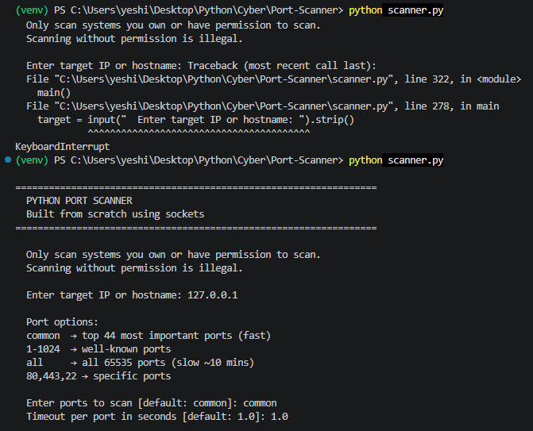
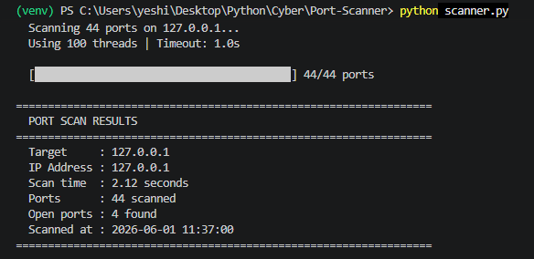
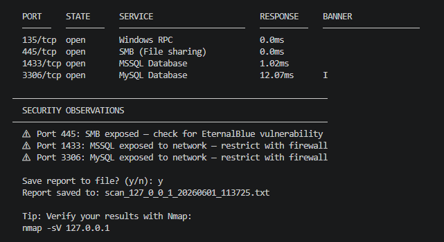
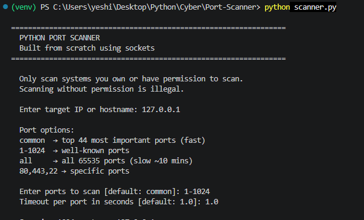
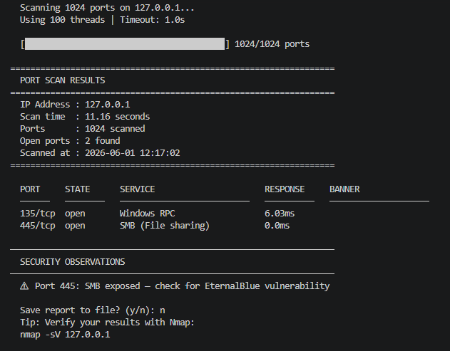

# Python Port Scanner

A multi-threaded TCP port scanner built from scratch using 
Python's socket library — no Nmap or external tools used.

## Features
- TCP connect scanning using raw sockets
- Multi-threaded scanning (100 ports simultaneously)
- Banner grabbing to identify service versions
- Service identification for 40+ common ports
- Security risk flagging for dangerous open ports
- Saves results to timestamped report files
- Supports single ports, ranges, comma lists, or all 65535 ports
- Validated against Nmap on scanme.nmap.org

## Usage
python scanner.py

## Tools Used
Python · Sockets · TCP/IP · Threading · Banner Grabbing

## Preview

